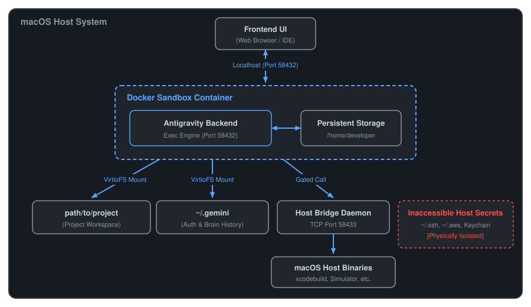

# Antigravity Sandbox: Docker Runtime for Google Antigravity

A high-performance container sandbox for **Google Antigravity** using Docker on macOS. It enables autonomous AI agents to execute shell commands, compile code, and manage packages inside an isolated Linux container without risking host system files, secrets, or toolchain stability.

---

## Why Antigravity Sandbox?

Autonomous AI coding agents routinely need to execute arbitrary shell commands (`bash`, `npm`, `pip`, `rm -rf`, compiler builds). Running these directly on your macOS host introduces significant risks:
- **Destructive Commands**: Accidental file deletion or misconfigured build scripts can damage host files and project repositories outside the current workspace.
- **Credential Exposure**: Unsandboxed processes have direct read access to `~/.ssh`, `~/.aws`, macOS Keychain, browser storage, and sensitive environment variables.
- **System Pollution**: Agent-driven package installations can alter host global dependencies and system configurations.

**Antigravity Sandbox** solves this by enforcing a hard container boundary while preserving seamless macOS developer ergonomics:

| Feature | Unsandboxed Default | Antigravity Sandbox |
| :--- | :--- | :--- |
| **Command Execution** | Runs directly on macOS host with full user permissions | Confined to isolated Ubuntu 24.04 Linux container |
| **Secret & System Isolation** | Full access to `~/.ssh`, `~/.aws`, Keychain, `/System` | Physically inaccessible; host files outside workspaces are isolated |
| **File Editing Ergonomics** | Native macOS editors | Native macOS editors with <1ms VirtioFS live synchronization |
| **Path Parity** | Host paths (`/Users/...`) | Exact 1:1 host path parity (`/Users/...` preserved in container) |
| **macOS Native Tool Access** | Direct host binary access | Controlled access via HMAC-authenticated, policy-gated Host Bridge |
| **State Persistence** | Stored directly on host | Retained across restarts via isolated named Docker volumes |

---

## Architecture & How It Works

Antigravity operates with a decoupled architecture where the Antigravity backend runs inside the container and exposes its web interface over local HTTPS loopback (`127.0.0.1:58432`).



---

## Quickstart

### Prerequisites
- **macOS** (Apple Silicon or Intel)
- **Docker Desktop** (with VirtioFS enabled)
- **Python 3** on host (used by CLI configuration scripts)

### 1. Clone the Repository
```bash
git clone https://github.com/battery-staple/antigravity-container.git
cd antigravity-container
```

### 2. Setup CLI
Symlink the CLI script into your `PATH`:
```bash
sudo ln -sf $(pwd)/scripts/antigravity-sandbox /usr/local/bin/antigravity-sandbox
```

### 3. Whitelist Workspace & Start
```bash
# Whitelist your project workspace
antigravity-sandbox workspace add /path/to/workspace

# Start the sandbox (builds container, starts Antigravity backend, and spawns Host Bridge)
antigravity-sandbox start
```

### 4. Access the Web Interface
Open [`https://localhost:58432`](https://localhost:58432) in any desktop web browser.
> **Note**: On first connection, bypass the local self-signed TLS certificate warning (see [Troubleshooting](#troubleshooting--faq)).

---

## Antigravity IDE Integration & Shared History

The sandbox is designed to work seamlessly alongside the standalone Antigravity IDE (built on VS Code). If you use Antigravity IDE and want its agent command execution to run sandboxed inside this container, attach to it by pressing <kbd>⌘</kbd>+<kbd>Shift</kbd>+<kbd>P</kbd> in Antigravity IDE, selecting **`Dev Containers: Attach to Running Container...`**, and choosing **`antigravity-sandbox`**.

- **Shared Authentication & Session State**: The host directory `~/.gemini` (Google account session, conversation brain logs, artifacts, etc.) is mounted into the container. The sandbox automatically inherits your Google login without requiring re-authentication in the browser.
- **Real-Time History Sync**: Conversations, task transcripts (`transcript.jsonl`), and generated artifacts (`~/.gemini/antigravity/brain`) synchronize in real-time between the host IDE and the sandbox container.

---

## Core Capabilities

### 1. Host-Exec Bridge (macOS Host Utilities)
Because the sandbox container runs Linux, macOS-native binaries (such as `xcodebuild`, iOS Simulator utilities, or system dialogs) cannot run directly inside the container. The Host-Exec bridge provides a secure, audited gateway for the agent to execute specific host binaries on the macOS host.

Security is enforced through a strict whitelist policy defined in `~/.antigravity-sandbox/whitelist.yaml`, which specifies permitted host binaries and allowed argument regular expression patterns. All communication between the container client and host daemon is signed and authenticated via HMAC using a local secret. For sensitive commands, setting `require_interactive_approval: true` in the whitelist triggers a native macOS confirmation prompt before the command is allowed to run. Inside the container, the agent invokes allowed utilities transparently using `host-exec <command>` and can inspect active permissions with `host-exec --list`.

### 2. Pre-Installed Toolchains & State Persistence
System compilers and base tools are declared in [`Dockerfile.sandbox`](file:///Users/rohengiralt/Documents/Code/LLM/antigravity-container/Dockerfile.sandbox):
- **Node.js & JavaScript**: Node.js 22 (LTS), `npm`, `yarn`, `pnpm`, `bun`
- **Python**: Python 3.12 (`python3`, `pip`, `venv`)
- **Go**: Go 1.23 (`go`, `GOPATH=/home/developer/go`)
- **Java & Kotlin**: OpenJDK 21 (LTS), Kotlin CLI compiler v2.1.10, Gradle v8.12.1
- **Linters & Formatters**: `ktlint`, `google-java-format`
- **C/C++**: `build-essential` (`gcc`, `g++`, `make`)

User modifications and package caches persist in the named Docker volume `antigravity_home_persist`:
- `npm install -g <pkg>` installs to `~/.npm-global` without root and persists across container rebuilds.
- `pip install --user <pkg>` installs to `~/.local` and persists across container rebuilds.
- `~/.gradle` and `~/go` module caches persist across container restarts.

To add custom system packages (e.g. `cmake`, `llvm`, `ffmpeg`), update `Dockerfile.sandbox` and run:
```bash
antigravity-sandbox build
```

### 3. Customizations: Skill Discovery & Sandbox Rules
The sandbox automatically discovers and integrates custom Antigravity skills and rules without exposing host files:
- **Skill Discovery**: The CLI scans global (`~/.gemini/config/skills.json`) and workspace (`.agents/skills.json`) configurations, resolves `"inherits"` dependency chains, and mounts discovered skill folders into the container as **read-only (`:ro`)** VirtioFS volumes.
- **Sandbox Rules Engine**: You can define container-specific instructions by placing Markdown files in `~/.antigravity-sandbox/rules/`. On start or restart, the sandbox compiles these along with host global rules into `~/.antigravity-sandbox/GEMINI.md`, which is mounted into the container while keeping your host macOS rules untouched.

Inspect active skills and compiled rules using:
```bash
antigravity-sandbox skills
antigravity-sandbox rules
```

---

## Troubleshooting & FAQ

### Browser displays "Your connection is not private" (Self-signed certificate)
The Antigravity backend generates a local self-signed TLS certificate for localhost HTTPS.
- In **Chrome / Brave / Edge**: Click **Advanced** $\rightarrow$ **Proceed to localhost (unsafe)**.
- In **Firefox**: Click **Advanced...** $\rightarrow$ **Accept the Risk and Continue**.
- In **Safari**: Click **Show Certificate** $\rightarrow$ check **Always Trust** $\rightarrow$ **Continue**.

### Agent reports `[HOST-EXEC ERROR] Host Bridge Daemon is not running`
If the host daemon was stopped or failed to spawn automatically:
```bash
# Check status
antigravity-sandbox host-bridge status

# Start daemon
antigravity-sandbox host-bridge start

# View logs
cat ~/.antigravity-sandbox/logs/host_exec_daemon.log
```

### Port 58432 is already in use
If another process or a previous container instance is occupying port 58432:
```bash
# Check what is listening on port 58432
lsof -iTCP:58432 -sTCP:LISTEN

# Stop existing sandbox instances
antigravity-sandbox stop
```

---

## Command Reference

### Command Summary Table

| Command | Description |
| :--- | :--- |
| `antigravity-sandbox start` | Starts the sandbox container, compiles rules/skills, and launches the host bridge |
| `antigravity-sandbox stop` | Stops the container and background host bridge daemon |
| `antigravity-sandbox restart` | Recompiles rules/mounts and restarts all sandbox services |
| `antigravity-sandbox status` | Displays container health, resource stats, and active mounts |
| `antigravity-sandbox build` | Rebuilds the sandbox Docker image from `Dockerfile.sandbox` |
| `antigravity-sandbox workspace add [path]` | Adds a host directory to the workspace whitelist and mounts it |
| `antigravity-sandbox workspace remove <path>` | Removes a workspace from the whitelist |
| `antigravity-sandbox workspace list` | Lists all currently whitelisted workspaces |
| `antigravity-sandbox skills` | Inspects discovered skills (`skills.json`) and active read-only mounts |
| `antigravity-sandbox rules` | Inspects active container agent rules and compilation status |
| `antigravity-sandbox open [rules\|whitelist.yaml]` | Opens the sandbox configuration directory or file in macOS Finder |
| `antigravity-sandbox host-bridge [start\|stop\|restart\|status\|fg]` | Controls the macOS Host-Exec bridge daemon |
| `antigravity-sandbox ui` | Opens the Antigravity Web UI (`https://localhost:58432`) in default browser |

### Common Workflows

```bash
# Add a second project workspace to the running sandbox
antigravity-sandbox workspace add /path/to/second-project

# Check container status and mounted directories
antigravity-sandbox status

# Open configuration folder in Finder to view whitelist or rules
antigravity-sandbox open
```

---

## Configuration Reference

Configuration files are centralized under `~/.antigravity-sandbox/`:

| Path | Purpose |
| :--- | :--- |
| `~/.antigravity-sandbox/whitelist.yaml` | Whitelisted workspace paths and Host-Exec command policies |
| `~/.antigravity-sandbox/rules/` | Custom sandbox-specific rule markdown files |
| `~/.antigravity-sandbox/ipc/` | Shared auth secret and PID files for host-bridge daemon |
| `~/.antigravity-sandbox/logs/` | Host-Exec daemon logs (`host_exec_daemon.log`) |

---

## Further Reading & Design Documents

- **Architecture Blueprint**: [`design/antigravity_sandbox_architecture.md`](file:///Users/rohengiralt/Documents/Code/LLM/antigravity-container/design/antigravity_sandbox_architecture.md)
- **Future Improvement (Container Snapshots & Rollbacks)**: [`design/future/snapshots_future_improvement.md`](file:///Users/rohengiralt/Documents/Code/LLM/antigravity-container/design/future/snapshots_future_improvement.md)
- **Future Improvement (Egress Sidecar Filtering)**: [`design/future/egress_filtering_future_improvement.md`](file:///Users/rohengiralt/Documents/Code/LLM/antigravity-container/design/future/egress_filtering_future_improvement.md)
