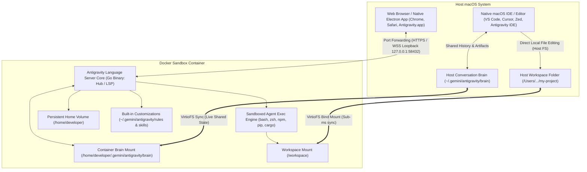
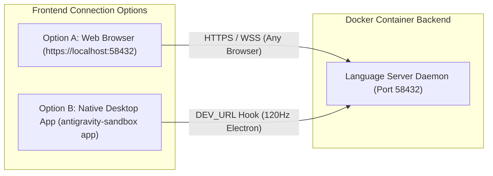
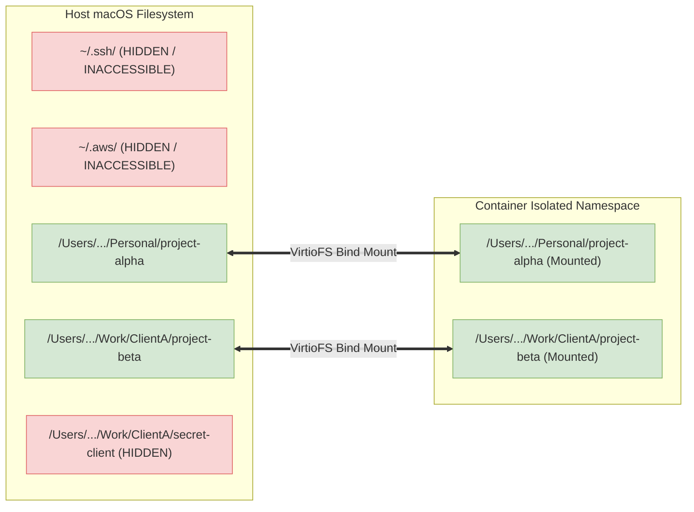
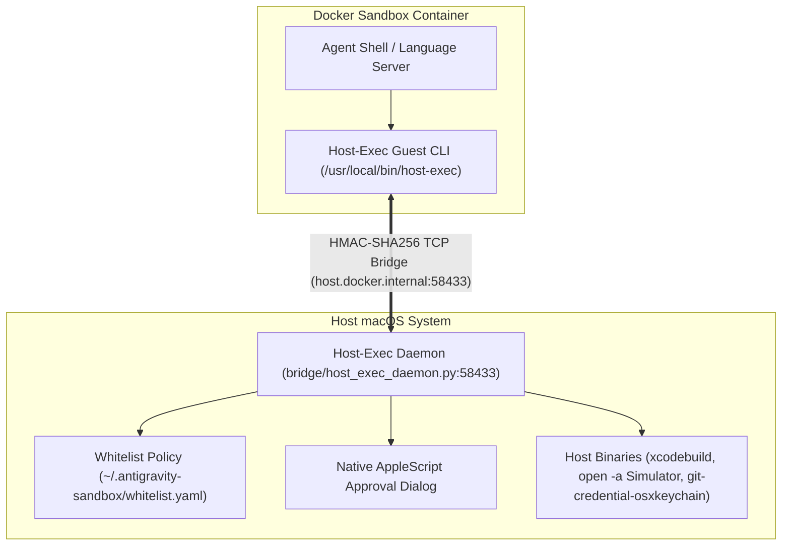
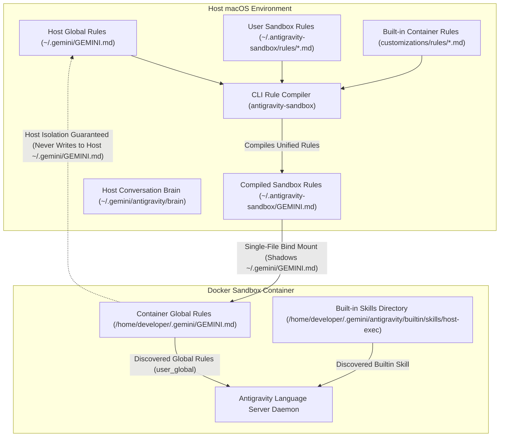

# Architectural Blueprint: Docker Sandbox for Google Antigravity Desktop App

## 1. Executive Summary & Core Objective

This architectural blueprint defines the engineering design for running the backend and command-execution runtime of the **Google Antigravity Desktop App** (`/Applications/Antigravity.app` on macOS) inside a secure, containerized sandbox using **Docker / OrbStack**.

### 1.1 The Core Problem & Security Invariant
In its default configuration, Google Antigravity executes shell commands, runs development compilers, and modifies files directly on the host macOS operating system with full user permissions. This poses significant risks:
- Destructive commands (`rm -rf /` or accidental deletion of home directories) can destroy host data.
- Unvetted dependencies or malicious code executing during agent workflows could access host secrets (`~/.ssh`, `~/.aws`, macOS Keychain, browser profiles, environment variables).
- Global toolchain installations (`brew`, global `npm`, system packages) pollute the host system.

**Core Security Invariant**: The agent must have full autonomy to execute arbitrary terminal commands, install packages, and compile projects inside an isolated Linux container, while remaining **strictly physically incapable** of accessing, modifying, or executing binaries on the host macOS system outside explicitly whitelisted project directories.



---

## 2. Antigravity Architecture & Frontend Connection Options

Antigravity operates as a decoupled client/server system where the backend core (`language_server`) serves a full HTTPS web application over port `58432`.

### 2.1 Two Simple Connection Options

Once the sandbox backend is running, you can connect using either of two zero-friction methods:



| Connection Method | Characteristics |
| :--- | :--- |
| **Option A: Web Browser** (`https://localhost:58432`) | Open directly in Chrome, Safari, Brave, Edge, or Firefox. Supports multi-tab/multi-window layouts with zero macOS application modifications. |
| **Option B: Native Desktop App** (`antigravity-sandbox app`) | Launches `/Applications/Antigravity.app` directly via built-in `DEV_URL` hook with native macOS window titlebar and system tray integration. |

#### Option A: Web Browser (`https://localhost:58432`)
- Open your preferred desktop browser (Chrome, Safari, Brave, Edge, Firefox) and navigate to `https://localhost:58432` (or `https://127.0.0.1:58432`).
- On initial connection, bypass the local self-signed TLS certificate warning (click **Advanced** $\rightarrow$ **Proceed to localhost**).
- *Benefits*: 100% feature parity (chat canvas, artifact rendering, subagent monitor, terminal tabs, file diffs), multi-tab support, and zero modification to `/Applications`.

#### Option B: Native Antigravity Desktop App (`antigravity-sandbox app`)
- Run `./scripts/antigravity-sandbox app` from your terminal.
- This invokes `/Applications/Antigravity.app` directly with the built-in `DEV_URL="https://127.0.0.1:58432"` environment variable.
- *Benefits*: Electron bypasses the certificate prompt automatically and renders the interface with native macOS window titlebar traffic lights and system tray integration.

---

## 3. Antigravity IDE Integration & Shared Conversation Brain

Antigravity IDE (built on VS Code) and the Antigravity Sandbox work together seamlessly:

### 3.1 Shared Conversation Transcripts & Artifacts
- Both the Antigravity Desktop App / Web UI and the Antigravity IDE persist conversation history, logs, and artifacts under:
  ```
  ~/.gemini/antigravity/brain/<conversation-id>/
  ```
- By bind-mounting the host's `~/.gemini/antigravity/brain` directory to `/home/developer/.gemini/antigravity/brain` inside the container:
  1. Conversations created in the container are immediately visible to the host IDE.
  2. Past conversations started in the IDE can be referenced via `@` mentions in the container.
  3. Transcripts (`transcript.jsonl`) and artifacts (`.md`) synchronize with sub-millisecond latency over VirtioFS.

### 3.2 Sandboxing IDE Agent Requests
- **Default Behavior**: Running the Antigravity IDE natively on macOS executes its internal agent extension directly on the host Mac.
- **To Sandbox IDE Agent Execution**: Use the standard command in Antigravity IDE:
  **`Dev Containers: Attach to Running Container...`** $\rightarrow$ select **`antigravity-sandbox`**.
  When attached, the IDE's entire workspace, extension host, and agent command runner execute **inside the container**.

---

## 4. Filesystem Synchronization & Real-World Usability

### 4.1 Direct Local File Editing via VirtioFS
The host project directory is bind-mounted directly to `/workspace` inside the container using macOS **VirtioFS**:
- **Throughput**: ~45,000 IOPS (near-native NVMe speed).
- **Latency**: Sub-millisecond (`<1ms`) `inotify` / `FSEvents` event propagation.
- **Workflow**: You can edit files directly in your native macOS editor (VS Code, JetBrains, Cursor, Zed) without git commits or cloud sync. All edits are immediately visible inside the sandbox in real time.

### 4.2 Automatic UID/GID Permission Mapping
On macOS, user accounts typically possess UID `501` and GID `20` (`staff`). Inside the Linux container, the user is `developer` (UID `1000`).
VirtioFS and Docker Compose automatically normalize UID/GID mappings, ensuring files created by the container inherit the host developer's ownership with zero `Permission Denied` errors.

### 4.3 Same-Mount Atomic Renames & The Cross-Device Invariant (`EXDEV`)
Antigravity's Go backend (`language_server`) uses atomic file operations (e.g. `os.CreateTemp` followed by `os.Rename`) to commit critical state files such as conversation summaries (`agyhub_summaries_proto.pb`) and state protobufs without corruption.
- **The Failure Mode**: In Linux, the `rename()` syscall cannot move files across different filesystem mount boundaries. If `TMPDIR` defaults to `/tmp` (which resides on the container rootfs `overlayfs`), renaming a temporary file to `/home/developer/.gemini/` (which resides on the VirtioFS host bind mount) fails with **`EXDEV` (Invalid cross-device link)**. This caused in-memory summaries to stream to the live UI while silently failing to commit to disk, resulting in lost conversation history upon container recreation.
- **The Architectural Fix**: `security/entrypoint.sh` explicitly creates and exports `export TMPDIR="/home/developer/.gemini/sandbox-tmp"`. By placing temporary staging files on the exact same VirtioFS mount device as the Antigravity application data directory, atomic `os.Rename()` calls succeed as native same-filesystem operations.

---

## 5. Sandboxed Command Execution & Blast Radius Containment

The sandbox enforces strict Linux kernel containment:
- **Dropped Capabilities**: The container runs with `cap_drop: ALL` and only essential unprivileged capabilities (`CHOWN`, `SETUID`, `SETGID`, `DAC_OVERRIDE`, `NET_BIND_SERVICE`).
- **PID Limit**: Capped at `pids: 1024` to prevent fork bombs.
- **Resource Quotas**: Configurable CPU (`4.0` cores) and memory (`8GB`) quotas prevent runaway scripts from freezing the host Mac.
- **Shared Memory (`shm_size`)**: Configured with `2GB` shared memory for smooth headless Chromium browser automation.
- **Host Isolation**: Destructive commands (`rm -rf /`) are 100% contained within the container rootfs and volume. Host macOS files, applications, and home directories outside `/workspace` are physically invisible.

---

## 6. Toolchain & Package Management

Package and environment management is split cleanly between declarative image definitions and user persistence:

### 6.1 Declarative Image Toolchains (`Dockerfile.sandbox`)
System libraries, SDKs, and base compilers (Node.js 22 LTS, Go 1.23, Python 3, build-essential) are defined in `Dockerfile.sandbox`.
- To add permanent system packages (e.g. `cmake`, `llvm`, `ffmpeg`), add them to `Dockerfile.sandbox` and run:
  ```bash
  antigravity-sandbox build
  ```

### 6.2 User State & Dotfile Persistence (`antigravity_home_persist`)
A persistent named volume is mounted at `/home/developer`:
- **Persists**: User dotfiles (`.bashrc`, `.zshrc`), tool caches (`.cache`, `.cargo`, `.npm`, `.pip`), user npm globals (`/home/developer/.npm-global`), and Go user tools (`/home/developer/go/bin`).
- `npm install -g <pkg>`: Installs to `~/.npm-global` without root and persists across container recreations.
- `pip install --user <pkg>`: Installs to `~/.local` and persists across container recreations.

---

## 7. Unified Persistent Workspace Whitelisting & Host Path Mirroring

### 7.1 The Strict Anti-Leak Invariant
> [!IMPORTANT]
> Parent directories (such as `/Users/rohengiralt` or `/Users/rohengiralt/Documents`) are **never mounted**. Each whitelisted project directory is mounted individually to its exact host absolute path (e.g. `/Users/rohengiralt/project-alpha`). Host secrets (`~/.ssh`, `~/.aws`, Keychain) and unwhitelisted sibling directories remain 100% physically inaccessible.



### 7.2 Unified Workspace Management

Workspaces are persisted in `~/.antigravity-sandbox/whitelist.yaml` and managed directly via the CLI:

```bash
# Add a workspace to the whitelist (defaults to current directory if omitted)
antigravity-sandbox workspace add /Users/rohengiralt/Documents/Personal/project-alpha

# Add another workspace (automatically updates running container mounts)
antigravity-sandbox workspace add /Users/rohengiralt/Work/ClientA/project-beta

# List currently whitelisted workspaces
antigravity-sandbox workspace list

# Remove a workspace from the whitelist
antigravity-sandbox workspace remove /Users/rohengiralt/Documents/Personal/project-alpha
```

### 7.3 Whitelist Policy (`~/.antigravity-sandbox/whitelist.yaml`)
```yaml
allowed_workspaces:
  - /Users/rohengiralt/Documents/Personal/project-alpha
  - /Users/rohengiralt/Work/ClientA/project-beta

allowed_commands:
  xcodebuild:
    binary_path: /usr/bin/xcodebuild
    allowed_args_regex: ^(-version|-showsdks|-list.*)$
    require_interactive_approval: false
```

### 7.4 Host Skill Directory Discovery & Read-Only Mounting (`skills.json`)
To support custom host skills without requiring manual workspace whitelisting or exposing whole parent directories, the sandbox features a modular discovery and mounting engine (`scripts/skills_mount.py`):
1. **Discovery Scope**: Scans global (`~/.gemini/config/skills.json`) and whitelisted workspace customization roots (`.agents/skills.json`, `.agent/skills.json`, etc.), following recursive `"inherits"` trees with cycle detection.
2. **Path Resolution & Validation**: Resolves home-relative (`~/`), absolute, and config-relative paths, validating their presence on the host before attempting to mount.
3. **Mount Conflict & Hierarchy Resolution**:
   - Skips skill directories that are already within an active read-write workspace.
   - Deduplicates nested skill directories (keeping only the top-level parent).
   - Retains skill directories that are ancestors of a workspace, ordering them so parent `:ro` mounts precede child `:cached` workspace mounts in `docker-compose.override.yml`.
4. **Security Invariant**: Discovered skill directories outside workspaces are strictly mounted **read-only (`:ro`)**, preventing container processes from modifying host skill repositories.

```bash
# View discovered skill configurations and active read-only mounts
antigravity-sandbox skills
```

---

## 8. Host Binary Whitelisting & Execution Bridge (Host-Exec)

### 8.1 Zero-Trust Architecture
Certain workflows require tools available only on the host macOS (e.g. `xcodebuild`, iOS Simulator `open -a Simulator`, macOS Keychain).



### 8.2 Whitelist Policy (`~/.antigravity-sandbox/whitelist.yaml`)
The whitelist file on macOS serves as the **single source of truth** for allowed host execution commands and policies. The daemon automatically hot-reloads this configuration on change without requiring a daemon restart:

```yaml
allowed_commands:
  xcodebuild:
    binary_path: /usr/bin/xcodebuild
    allowed_args_regex: ^(-version|-showsdks|-list.*)$
    require_interactive_approval: false
    description: Apple Xcode build system and SDK inspection
  simulator:
    binary_path: /usr/bin/open
    allowed_args_regex: ^-a Simulator$
    require_interactive_approval: false
    description: Launch Apple iOS Simulator
  git-credential-osxkeychain:
    binary_path: /usr/bin/git
    allowed_args_regex: ^credential-osxkeychain (get|store|erase)$
    require_interactive_approval: true
    description: macOS Keychain Git credential helper
  sw_vers:
    binary_path: /usr/bin/sw_vers
    allowed_args_regex: ^.*$
    require_interactive_approval: false
    description: macOS system version information
```

### 8.3 Live Introspection (`host-exec --list`)
The agent and user can inspect all active whitelisted host commands and policies at any time by executing:
```bash
host-exec --list
```
This queries the daemon over IPC and displays a live table with descriptions, binary paths, allowed argument regexes, and approval requirements.

### 8.4 Asynchronous Concurrency, Interleaving Guarantees & Process Lifecycle
The host bridge employs an `asyncio` event-driven architecture designed for high-concurrency multi-agent and multi-conversation workflows:

1. **Non-Blocking Parallel Execution**:
   The daemon serves incoming TCP connections asynchronously (`asyncio.start_server`). Fast non-interactive commands (e.g. `sw_vers`) and introspection queries (`--list`) complete within milliseconds without Head-of-Line (HOL) blocking behind long-running tasks (e.g. `xcodebuild`).
2. **Interactive Approval Modal Serialization**:
   Commands requiring user confirmation (`require_interactive_approval: true`) acquire an asynchronous FIFO lock (`_approval_lock`). This prevents overlapping or competing macOS AppleScript dialogs, ensuring modal prompts are presented sequentially with clear trajectory and request attribution, while non-interactive commands continue running in parallel.
3. **Trajectory & Context Attribution**:
   Guest client invocations automatically inject `ANTIGRAVITY_TRAJECTORY_ID` and generate a unique `request_id`. Foreground daemon logs correlate events with structured, color-coded tokens (`[req:<id>] [traj:<id>] [command]`).
4. **Process Concurrency Governance & Reaping**:
   A global semaphore (`MAX_CONCURRENT_HOST_PROCESSES = 16`) bounds total active host processes to protect host system stability. If a client disconnects or aborts mid-execution, the daemon immediately detects EOF and calls `proc.terminate()` on the active child process, preventing zombie or orphaned processes.

---

## 9. Agent Awareness & Customizations (Evergreen Rules & Skills)

To ensure the AI agent operates with complete clarity about its execution environment without brittle manual synchronization, the sandbox provisions evergreen Antigravity customizations and supports user-defined sandbox-specific rules:



### 9.1 Container Environment Rule (`customizations/rules/container-environment.md`)
- **Type**: Built-in Always-On Rule (compiled into `/home/developer/.gemini/GEMINI.md`).
- **Function**:
  - Informs the agent that it runs inside an isolated Ubuntu 24.04 Linux container.
  - Confirms it has full impunity to run terminal commands, compile code, create temporary files, and install packages.
  - Informs the agent that macOS-specific tools cannot be run directly via shell, but must be executed using the `host-exec` tool via the `host-exec` skill.
  - **Evergreen Design**: Does not hardcode specific tool names, eliminating any need to edit rules when whitelist policies change.

### 9.2 Sandbox-Specific Global Rules & `GEMINI.md` Shadow-Mount Pattern
To allow the container agent to inherit global user rules from macOS and load custom sandbox rules while preventing container-specific rules from leaking to the host:
1. **The Leak Risk**: The host `~/.gemini` directory is bind-mounted at `/home/developer/.gemini` for OAuth tokens and shared state. If the container wrote container-specific rules directly into `/home/developer/.gemini/GEMINI.md`, it would write to the host's `~/.gemini/GEMINI.md`, causing host agents on macOS to mistakenly believe they are running inside Ubuntu 24.04.
2. **Host-Side Pre-Compilation**:
   - `scripts/antigravity-sandbox` aggregates:
     - Built-in container rules (`customizations/rules/*.md`)
     - User sandbox rules (`~/.antigravity-sandbox/rules/*.md`)
     - Host global rules (`~/.gemini/GEMINI.md`, if present on macOS)
   - The CLI compiles these into a single unified Markdown file at `~/.antigravity-sandbox/GEMINI.md`.
3. **Single-File Shadow Mount**:
   - `docker-compose.yml` mounts `~/.antigravity-sandbox/GEMINI.md` directly over `/home/developer/.gemini/GEMINI.md`.
   - This cleanly shadows the file within the container so the Language Server discovers it as `user_global` memory (`globalScope: {}`).
4. **Outcome**:
   - The in-container Language Server discovers and loads all host rules **plus** built-in container rules **plus** user sandbox rules.
   - The host's `~/.gemini/GEMINI.md` file remains completely clean and untouched.
   - No `tmpfs` mounts, no `sudo chown` startup hacks, and no artificial filename collision aborts are required.

### 9.3 Host-Exec Runbook Skill (`customizations/skills/host-exec/SKILL.md`)
- **Type**: On-Demand Progressive Disclosure Skill (seeded into `/home/developer/.gemini/antigravity/builtin/skills/host-exec/`).
- **Function**:
  - Documents exact `host-exec <command> [args...]` usage, live discovery (`host-exec --list`), and path translation.
  - Explains the interactive AppleScript approval dialog flow.
  - Details remediation steps when the host bridge daemon is offline (asking the user to run `antigravity-sandbox host-bridge`).
  - Guides the agent on handling whitelist rejections dynamically via `host-exec --list`.

---

## 10. Exact File Manifest

The table below details all files implementing this architecture:

| File Path | Description |
| :--- | :--- |
| [`Dockerfile.sandbox`](file:///Users/rohengiralt/Documents/Code/LLM/antigravity-container/Dockerfile.sandbox) | Hardened Ubuntu 24.04 image with Node.js 22, Go 1.23, Python 3, built-in Antigravity language_server, customizations, and user setup. |
| [`docker-compose.yml`](file:///Users/rohengiralt/Documents/Code/LLM/antigravity-container/docker-compose.yml) | Service definition, VirtioFS bind mounts, `GEMINI.md` shadow mount, shared brain volume, dev ports (3000-3005, 5173, 8080, 8081), and shm_size (2gb). |
| [`scripts/antigravity-sandbox`](file:///Users/rohengiralt/Documents/Code/LLM/antigravity-container/scripts/antigravity-sandbox) | Unified CLI tool (`start`, `stop`, `restart`, `build`, `app`, `host-bridge`, `status`, `workspace`, `skills`, `rules`). |
| [`scripts/skills_mount.py`](file:///Users/rohengiralt/Documents/Code/LLM/antigravity-container/scripts/skills_mount.py) | Modular skills engine for discovery, recursive inheritance parsing, conflict resolution, and volume generation. |
| [`tests/test_skills_mount.py`](file:///Users/rohengiralt/Documents/Code/LLM/antigravity-container/tests/test_skills_mount.py) | Unit tests verifying all modular stages and edge cases of the skills mounting engine. |
| [`tests/test_host_exec_daemon.py`](file:///Users/rohengiralt/Documents/Code/LLM/antigravity-container/tests/test_host_exec_daemon.py) | Unit tests verifying HMAC security, cwd resolution, and whitelist validation. |
| [`tests/test_host_exec_client.py`](file:///Users/rohengiralt/Documents/Code/LLM/antigravity-container/tests/test_host_exec_client.py) | Unit tests verifying client context injection, argument parsing, and capabilities formatting. |
| [`tests/test_host_exec_concurrency.py`](file:///Users/rohengiralt/Documents/Code/LLM/antigravity-container/tests/test_host_exec_concurrency.py) | Asynchronous concurrency integration tests verifying non-blocking execution, modal serialization, and process reaping. |
| [`security/entrypoint.sh`](file:///Users/rohengiralt/Documents/Code/LLM/antigravity-container/security/entrypoint.sh) | Container entrypoint auto-seeding skills and launching language server. |
| [`customizations/rules/container-environment.md`](file:///Users/rohengiralt/Documents/Code/LLM/antigravity-container/customizations/rules/container-environment.md) | Built-in agent rule explaining container environment and impunity. |
| `~/.antigravity-sandbox/rules/*.md` | User-defined global rules that only apply when executing inside the sandbox container. |
| `~/.antigravity-sandbox/GEMINI.md` | Compiled sandbox rules document shadowed into the container. |
| [`customizations/skills/host-exec/SKILL.md`](file:///Users/rohengiralt/Documents/Code/LLM/antigravity-container/customizations/skills/host-exec/SKILL.md) | Agent skill runbook for invoking whitelisted host binaries via `host-exec`. |
| [`bridge/host_exec_daemon.py`](file:///Users/rohengiralt/Documents/Code/LLM/antigravity-container/bridge/host_exec_daemon.py) | Host daemon listening on port 58433, enforcing whitelist policies with AppleScript dialogs. |
| [`bin/host-exec`](file:///Users/rohengiralt/Documents/Code/LLM/antigravity-container/bin/host-exec) | Guest client generating canonical HMAC-SHA256 signatures for host binary execution. |
| `~/.antigravity-sandbox/whitelist.yaml` | Whitelist policy defining allowed host binaries, argument regexes, and approval rules. |
| [`README.md`](file:///Users/rohengiralt/Documents/Code/LLM/antigravity-container/README.md) | User runbook and operational quickstart. |
| [`design/future/snapshots_future_improvement.md`](file:///Users/rohengiralt/Documents/Code/LLM/antigravity-container/design/future/snapshots_future_improvement.md) | Optional future improvement document for adding instant container snapshots and rollbacks. |
| [`design/future/egress_filtering_future_improvement.md`](file:///Users/rohengiralt/Documents/Code/LLM/antigravity-container/design/future/egress_filtering_future_improvement.md) | Optional future improvement document for adding a Squid egress proxy sidecar. |

---

## 11. Operational Runbook

```bash
# 1. Whitelist your project workspace
./scripts/antigravity-sandbox workspace add /path/to/my-project

# 2. Start the sandbox (automatically spawns host-bridge daemon in background)
./scripts/antigravity-sandbox start

# (Optional: start without host-bridge)
# ./scripts/antigravity-sandbox start --no-host-bridge

# 3. Connect to the UI (Choose either Option A or B):
# Option A: Open browser to https://localhost:58432
# Option B: Launch native desktop app
./scripts/antigravity-sandbox app

# 4. Rebuild container image after modifying Dockerfile.sandbox
./scripts/antigravity-sandbox build

# 5. Manage host execution bridge (optional)
./scripts/antigravity-sandbox host-bridge status
```
