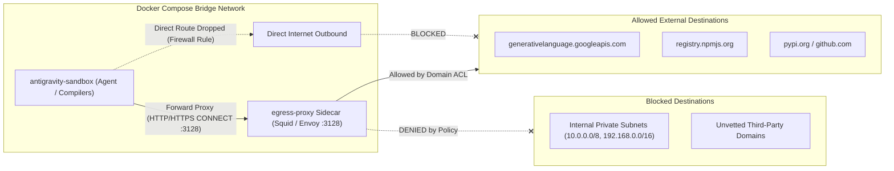

# Future Improvement: Egress Proxy Sidecar Filtering for Antigravity Sandbox

This document outlines an optional, enterprise-grade future enhancement for the **Antigravity Docker Sandbox**: adding an **Egress Filtering Sidecar** to restrict and cryptographically audit outbound network traffic from the sandbox container.

---

## 1. Overview & Motivation

In the base sandbox architecture, the agent can access the public internet to download package dependencies (`npm`, `pip`, `go`, `cargo`) and query the Gemini API (`generativelanguage.googleapis.com`).

For organizations or developers requiring strict data exfiltration prevention, an **Egress Filtering Sidecar** can be added to enforce granular domain and IP whitelisting:
- **Block Unapproved External Domains**: Prevent the agent or downloaded scripts from contacting unvetted third-party servers.
- **Isolate Local Private Networks**: Block access to internal private LAN subnets (`10.0.0.0/8`, `172.16.0.0/12`, `192.168.0.0/16`, home router admin panels).
- **Log & Audit Traffic**: Capture a cryptographic audit log of all HTTP/HTTPS CONNECT requests initiated by the agent.

---

## 2. Architecture



---

## 3. Implementation Blueprint

### 3.1 Docker Compose Configuration
To add the sidecar, add an `egress-proxy` service in `docker-compose.override.yml` or `docker-compose.yml`:

```yaml
services:
  antigravity-sandbox:
    environment:
      - HTTP_PROXY=http://egress-proxy:3128
      - HTTPS_PROXY=http://egress-proxy:3128
      - ALL_PROXY=http://egress-proxy:3128
      - NO_PROXY=127.0.0.1,localhost,host.docker.internal,egress-proxy
    depends_on:
      - egress-proxy

  egress-proxy:
    image: ubuntu/squid:edge
    container_name: antigravity-egress-proxy
    restart: unless-stopped
    volumes:
      - ./security/egress-whitelist.squid.conf:/etc/squid/squid.conf:ro
    ports:
      - "127.0.0.1:3128:3128"
```

### 3.2 Squid Whitelist Policy (`security/egress-whitelist.squid.conf`)
```squid
# Define standard ports
acl SSL_ports port 443
acl Safe_ports port 80 443
http_access deny !Safe_ports
http_access deny CONNECT !SSL_ports

# Allowed Domain Whitelists
acl google_ai dstdomain generativelanguage.googleapis.com daily-cloudcode-pa.googleapis.com accounts.google.com
acl package_registries dstdomain registry.npmjs.org pypi.org files.pythonhosted.org crates.io index.crates.io proxy.golang.org
acl git_repos dstdomain github.com .github.com objects.githubusercontent.com raw.githubusercontent.com
acl os_repos dstdomain .ubuntu.com

# Allow whitelisted domains
http_access allow google_ai
http_access allow package_registries
http_access allow git_repos
http_access allow os_repos

# Deny private internal subnets & all other destinations
acl local_subnets dst 10.0.0.0/8 172.16.0.0/12 192.168.0.0/16 127.0.0.0/8
http_access deny local_subnets
http_access deny all

http_port 3128
```

---

## 4. Why This is Recommended as a Future Add-on

1. **Zero Base Code Changes**: The base Antigravity Docker container image (`Dockerfile.sandbox`) requires no modifications to support this. Proxy variables are standard across Linux developer toolchains.
2. **Easy Step-Up**: Developers can adopt the base sandbox today with zero proxy configuration friction, and attach the egress sidecar later when organizational or security compliance requirements demand it.
