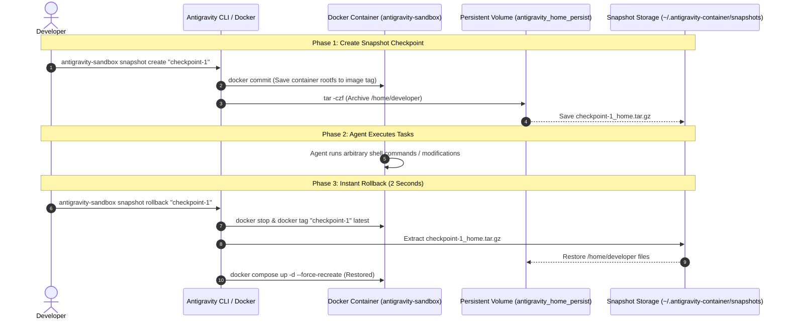

# Future Improvement: State Snapshotting & Instant Rollbacks for Antigravity Sandbox

This document outlines an optional future enhancement for the **Antigravity Docker Sandbox**: adding **Instant Container Snapshots & State Rollbacks** to checkpoint the sandbox environment before executing experimental or destructive agent tasks.

---

## 1. Overview & Motivation

In the base sandbox architecture, system-level packages and development toolchains are declaratively installed and managed in `Dockerfile.sandbox`. 

While this ensures a clean, reproducible base image, developers occasionally want the ability to:
- **Test experimental agent workflows**: Give an agent freedom to modify system files or test package migrations with a 1-click safety net.
- **Instant Rollbacks**: Revert the container image and persistent user volumes to an earlier timestamped checkpoint in ~2 seconds without rebuilding from scratch.

---

## 2. Architecture & Under-the-Hood Mechanics



---

## 3. Proposed CLI Implementation

To add snapshot management to `scripts/antigravity-sandbox`:

```bash
# 1. Create a snapshot before a risky task
antigravity-sandbox snapshot create "pre-migration-v1"

# 2. List available checkpoints
antigravity-sandbox snapshot list

# 3. Rollback to checkpoint in 2 seconds
antigravity-sandbox snapshot rollback "pre-migration-v1"
```

### Script Implementation Logic
```bash
case "$1" in
  snapshot)
    ACTION="$2"
    TAG="$3"
    SNAPSHOT_DIR="$HOME/.antigravity-container/snapshots"
    mkdir -p "$SNAPSHOT_DIR"

    case "$ACTION" in
      create)
        TAG="${TAG:-snapshot-$(date +%Y%m%d_%H%M%S)}"
        echo "[Snapshot] Checkpointing container rootfs: $TAG..."
        docker commit antigravity-sandbox "antigravity-sandbox:$TAG"
        
        echo "[Snapshot] Archiving persistent home volume..."
        docker run --rm -v antigravity_home_persist:/data -v "$SNAPSHOT_DIR:/backup" \
          antigravity-sandbox:latest tar -czf "/backup/${TAG}_home.tar.gz" -C /data .
        echo "[Snapshot] Checkpoint $TAG created successfully."
        ;;
      list)
        docker images "antigravity-sandbox" --format "table {{.Repository}}:{{.Tag}}\t{{.Size}}\t{{.CreatedAt}}"
        ;;
      rollback)
        if [ -z "$TAG" ]; then echo "Error: specify tag to rollback"; exit 1; fi
        echo "[Snapshot] Rolling back to $TAG..."
        docker stop antigravity-sandbox
        docker tag "antigravity-sandbox:$TAG" antigravity-sandbox:latest
        
        # Restore volume
        docker run --rm -v antigravity_home_persist:/data -v "$SNAPSHOT_DIR:/backup" \
          antigravity-sandbox:latest sh -c "rm -rf /data/*; tar -xzf /backup/${TAG}_home.tar.gz -C /data"
        
        docker compose up -d --force-recreate
        echo "[Snapshot] Rollback to $TAG complete."
        ;;
    esac
    ;;
esac
```

---

## 4. Why This is Recommended as a Future Add-on

1. **Keep Base Setup Ultra-Light**: By relying on `Dockerfile.sandbox` for standard package management, the base sandbox avoids auxiliary backup directory tracking and tarball storage overhead.
2. **Modular Extension**: Because the snapshotting logic only interacts with standard Docker APIs (`docker commit`, named volume mounts), it can be dropped into the CLI script whenever instant rollback capabilities are desired.
